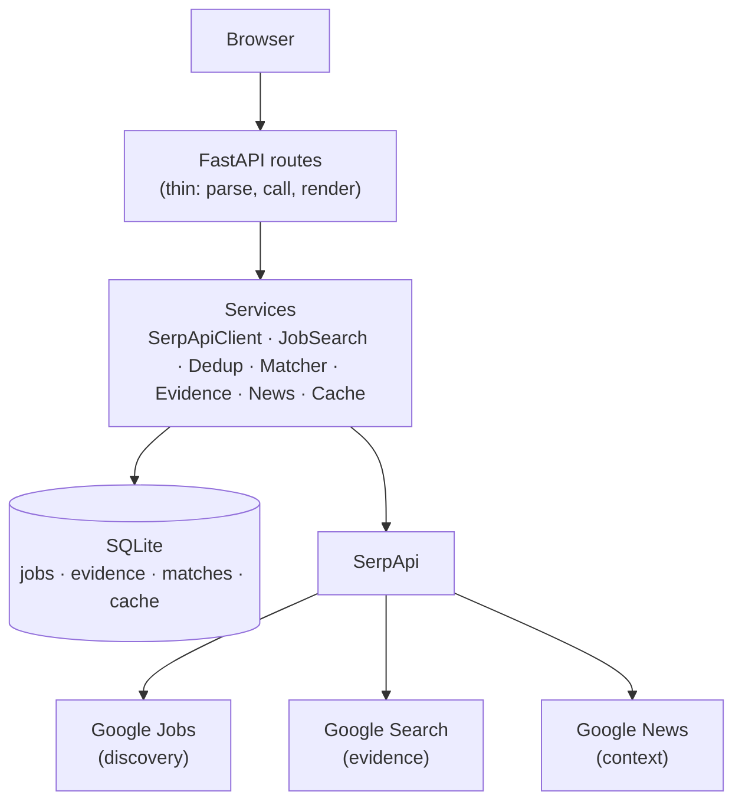

# JobSetu

Evidence-powered job intelligence for Indian freshers.

## Status

Slice 5 implemented (final feature slice). The full loop is live: DISCOVER →
DEDUP → MATCH → VERIFY → NEWS CONTEXT → GAP → APPLY. Remaining work is
rehearsal, deployment, screenshots/video, and submission — not features.

Slice 5 provides: Google News company context (rule-based categories,
recency, sources), on-demand + pre-enriched news with failure isolation,
`python -m app.demo_seed` warm-cache command, `/debug/usage` credit view,
hero/UI polish, `docs/demo.md` + `docs/submission.md`.

## Architecture

See `docs/architecture.md` (full), `docs/deduplication.md`,
`docs/implementation-plan.md`, `docs/research.md`.

Flow: Browser → FastAPI routes → services → SQLAlchemy → SQLite.
Only `SerpApiClient` talks to SerpApi; routes never see raw SerpApi JSON.

## Tech stack

Python, FastAPI, SQLAlchemy, SQLite, Pydantic v2, Jinja2, vanilla CSS/JS.

## Local setup

```powershell
python -m venv .venv
.\.venv\Scripts\Activate.ps1
pip install -r requirements.txt
copy .env.example .env
```

Add your key to `.env`:

```
SERPAPI_KEY=your-key-here
```

## Environment variables

| Name | Default | Notes |
|---|---|---|
| `SERPAPI_KEY` | empty | Server-side only. Required for live search. |
| `DATABASE_URL` | `sqlite:///./jobsetu.db` | Local SQLite file. |
| `EVIDENCE_MAX_JOBS` | `5` | Top-N jobs enriched per search (credit control). |
| `ENABLE_NEWS` | `false` | P1 flag (not yet implemented). |
| `ENABLE_MAPS` | `false` | P1 flag (not yet implemented). |
| `ENABLE_TRENDS` | `false` | P1 flag (not yet implemented). |
| `ENABLE_PDF` | `false` | P1 flag (not yet implemented). |

Never commit `.env`.

## Run

```powershell
python -m uvicorn app.main:app --reload
```

Open `http://127.0.0.1:8000`, create your profile at `/profile`
(or use the labeled sample-data prefill), then fill role + location and
press Find jobs. Match scores appear only when a profile exists.

## Demo seeding (warm cache)

```powershell
python -m app.demo_seed
```

Requires `SERPAPI_KEY`. Runs the demo search end-to-end, creates the sample
profile if none exists, warms jobs + evidence + news caches, and prints
measured request counts and elapsed time. Demo warm afterwards.

## Credit visibility

`/debug/usage` (dev-only, no auth) shows real per-engine call counts,
cache entries, and stored rows. The API key is never displayed.

## Deployment

```powershell
# Environment (never commit .env)
SERPAPI_KEY=<key>            # required for live data
DATABASE_URL=sqlite:////data/jobsetu.db
EVIDENCE_MAX_JOBS=5
NEWS_MAX_JOBS=3
PORT=8000
```

Docker (SQLite persisted on a volume):

```powershell
docker build -t jobsetu .
docker run -p 8000:8000 -e SERPAPI_KEY=<key> -v jobsetu-data:/data jobsetu
```

Or any Python host (Render/Railway/HF Spaces): install requirements,
set env vars, serve `uvicorn app.main:app --host 0.0.0.0 --port $PORT`.
Health: `GET /health` (no secrets). Then warm the demo:
`python -m app.demo_seed`.

## Architecture



Details: `docs/architecture.md`. Verification rules: `docs/verification.md`.
Matching formula: `docs/matching.md`. Demo tour: `docs/demo.md`.

## Matching

Deterministic and explainable: Skills 50 + Title 20 + Experience 15 +
Location 10 + Type 5 = 100. Same candidate + same job always gives the same
score. Missing data yields neutral sub-scores with explicit flags, never
fake precision. Full formula, weights, and limitations: `docs/matching.md`.

## Verification

Each search enriches the top-`EVIDENCE_MAX_JOBS` listings with live Google
Search evidence (cached 7 days): official-site detection, company/role
presence, location support. Statuses are Supporting evidence, Needs
verification, or Warning signals — no numeric trust scores, and every claim
links to its source on `GET /jobs/{id}/evidence`. Rules and limitations:
`docs/verification.md`.

## Why SerpApi?

SerpApi is the data backbone, not a search box. Remove it and the product
has nothing:

- Google Jobs → discovery. Without it there are no listings at all.
- Google Search → independent evidence. VERIFY re-searches the company
  behind each listing and cites every source.
- Google News → recent context. Layoffs, funding, and expansion headlines
  with dates and sources, categorized by deterministic rules.

Pipeline: search → normalize → deduplicate → enrich → match → verify →
skill gap. See `docs/demo.md` for the 90-second tour.

## Screenshots

Real UI captures (fresh database, no demo data fabricated):

- `docs/screenshots/01-landing.png` — search form
- `docs/screenshots/02-profile.png` — profile with labeled sample prefill
- `docs/screenshots/03-usage.png` — dev credit dashboard

Results/evidence/news screenshots require a live `SERPAPI_KEY` run
(`python -m app.demo_seed`, then capture) — still pending.

## Search endpoint

`POST /search` (form fields: `role`, `location`, `experience`).
Sends `q=<role>`, `location=<location>, India`, `gl=in`, `hl=en` to
`engine=google_jobs`, follows one `next_page_token` at most.

## Caching

Google Jobs responses are cached in SQLite for 24 hours (key = engine +
normalized params). Repeat searches serve cache without spending credits.
The results page shows `LIVE` or `CACHED · retrieved X ago`; if live search
fails, stale cache is shown with a warning banner instead of fake data.

## Tests

```powershell
python -m pytest
```

SerpApi is mocked in all tests; no real API calls, no key needed.
