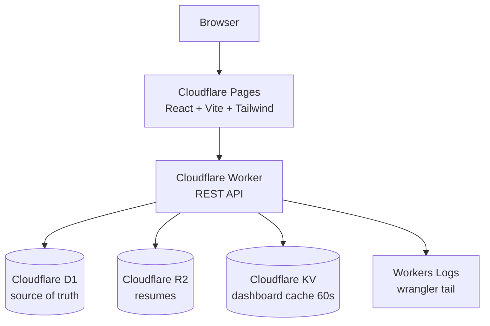

# Student Job Application Tracker (Cloudflare Full-Stack)

A production-style portfolio project for CSE graduates: track job applications, interviews,
notes, follow-ups, and resumes on **100% Cloudflare free-tier-friendly** infrastructure.

 

> Screenshots: add `docs/screenshot-dashboard.png`, `docs/screenshot-applications.png` after first run.

## Features

- **Auth** — register / login / logout, persistent sessions (Bearer token + HttpOnly cookie), PBKDF2-SHA256 password hashing, never returns password hashes.
- **Dashboard** — totals (total/applied/interviewing/offers/rejected/saved), by-status chart bars, upcoming interviews, recent applications, overdue + upcoming follow-ups.
- **Applications** — full CRUD with company, title, location, URL, type, salary, date, status (`SAVED/APPLIED/OA/INTERVIEW/OFFER/REJECTED/WITHDRAWN`), notes, contacts, follow-up fields, optional resume link.
- **Search/filter/sort/pagination** — server-side (`LIKE` on company/title, status/type/date filters, newest/oldest, `LIMIT/OFFSET` + total count).
- **Interviews** — linked to an application, types (`PHONE/OA/TECHNICAL/HR/BEHAVIORAL/FINAL`), upcoming list on dashboard.
- **Resumes (R2)** — upload/view(download)/delete, metadata only in D1, strict MIME/size/filename validation, Worker-only R2 access.
- **Notes** — per-application create/edit/delete.
- **Follow-ups** — reminder flag + date + notes; overdue shown separately (`⚠ Follow up with Google, Due: …`).
- **UI** — sidebar + top nav, cards, tables, status badges, modals, loading/empty/error states, toasts, confirm-before-delete, mobile responsive, accessible labels + keyboard-focusable dialogs.

## Architecture



- One Worker, one D1 database, one R2 bucket, one KV namespace. No microservices.
- KV caches `dashboard:{userId}` for 60s; D1 is always the source of truth; mutations invalidate the cache.
- Observability via `console.log` in the Worker, read with `wrangler tail`.

## Tech Stack

| Layer | Choice |
|---|---|
| Frontend | React 18, TypeScript, Vite 5, Tailwind CSS 3, React Router 6 |
| Backend | Cloudflare Workers, TypeScript, vanilla REST router (no framework) |
| DB | Cloudflare D1 (SQLite), SQL migrations |
| Files | Cloudflare R2 (Worker-only access) |
| Cache | Cloudflare KV (dashboard stats) |
| Tooling | Wrangler 3, Vitest, GitHub Actions |

## Database Schema

Tables: `users`, `sessions`, `applications`, `interviews`, `notes`, `resumes` — UUID PKs, FKs with `ON DELETE CASCADE/SET NULL`, `created_at/updated_at` timestamps, indexes in `migrations/0002_indexes.sql`.

```
users(id, email UNIQUE, password_hash, name, created_at, updated_at)
sessions(id, user_id FK, token_hash UNIQUE, expires_at, created_at)
resumes(id, user_id FK, filename, content_type, size, r2_key UNIQUE, created_at)
applications(id, user_id FK, company, job_title, location, job_url, job_type, salary,
  application_date, status, notes, contact_person, contact_email,
  follow_up_date, follow_up_reminder, follow_up_notes, resume_id FK NULL, timestamps)
interviews(id, user_id FK, application_id FK, interview_type, scheduled_at, interviewer, meeting_url, notes, result, timestamps)
notes(id, user_id FK, application_id FK, content, timestamps)
```

## API Endpoints

Consistent envelope: `{ "success": true, "data": … }` / `{ "success": false, "error": { "code", "message", "details?" } }`.

```
POST /api/auth/register   POST /api/auth/login   POST /api/auth/logout   GET /api/auth/me
GET  /api/applications?search=&status=&job_type=&date_from=&date_to=&sort=newest|oldest&page=&limit=
POST /api/applications
GET  /api/applications/:id   PUT /api/applications/:id   DELETE /api/applications/:id
GET  /api/interviews?application_id=&upcoming=true   POST /api/interviews
PUT  /api/interviews/:id   DELETE /api/interviews/:id
GET  /api/notes?application_id=   POST /api/notes
PUT  /api/notes/:id   DELETE /api/notes/:id
POST /api/resumes (multipart `file`)   GET /api/resumes
GET  /api/resumes/:id   GET /api/resumes/:id/download   DELETE /api/resumes/:id
GET  /api/dashboard
GET  /api/health
```

## Local Development

Prereqs: Node 20+, `npm`, Wrangler (`npx wrangler --version`).

```bash
# 1. Install
npm install --workspaces
# or: (cd worker && npm install) && (cd frontend && npm install)

# 2. Configure local secrets (placeholders only in repo)
cp worker/.dev.vars.example worker/.dev.vars
cp frontend/.env.example frontend/.env
cp .env.example .env   # reference only

# 3. Create local Cloudflare resources (one-time)
npx wrangler d1 create student_job_tracker      # paste database_id into worker/wrangler.toml
npx wrangler r2 bucket create job-tracker-resumes
npx wrangler kv namespace create CACHE

# 4. Run migrations locally
(cd worker && npm run db:migrate:local)

# 5. Start API + frontend (two terminals)
(cd worker && npx wrangler dev)     # http://127.0.0.1:8787
(cd frontend && npm run dev)        # http://localhost:5173 (proxies /api to :8787)

# 6. Verify
(cd worker && npm test && npm run typecheck)
(cd frontend && npm run typecheck && npm run build)
```

R2 locally works via Wrangler dev (persists under `.wrangler/`); KV cache is optional — the API works without the `CACHE` binding.

## Cloudflare Setup

1. `npx wrangler login`
2. `npx wrangler d1 create student_job_tracker` → set `database_id` in `worker/wrangler.toml`.
3. `npx wrangler d1 migrations apply student_job_tracker --remote` (runs `migrations/`).
4. `npx wrangler r2 bucket create job-tracker-resumes`.
5. `npx wrangler kv namespace create CACHE` → set `id` in `worker/wrangler.toml`.
6. Set secrets: `npx wrangler secret put SESSION_SECRET` (and `FRONTEND_ORIGIN` as var/secret to your Pages URL).
7. Deploy API: `(cd worker && npm run deploy)`.
8. Deploy frontend: set `VITE_API_URL=https://<worker>.workers.dev` in Pages env, then `npx wrangler pages deploy frontend/dist --project-name=student-job-tracker` (or connect the GitHub repo in the Pages dashboard).
9. Observe: `npx wrangler tail` (Workers Logs).

## Environment Variables

| Var | Where | Purpose |
|---|---|---|
| `SESSION_SECRET` | Worker secret / `.dev.vars` | reserved for future signed cookies (sessions currently opaque random tokens, SHA-256 hashed in D1) |
| `FRONTEND_ORIGIN` | Worker var | CORS allow-origin (Pages URL in prod, `http://localhost:5173` locally) |
| `VITE_API_URL` | Pages env / `frontend/.env` | Worker URL; empty = same-origin/Vite proxy |

See `.env.example`, `worker/.dev.vars.example`, `frontend/.env.example`. Never commit real values.

## D1 Migrations

- `migrations/0001_initial.sql` — tables + FKs.
- `migrations/0002_indexes.sql` — indexes for user-scoped filtering/sorting.
- Never edit prod schema by hand: add `migrations/0003_*.sql` and `wrangler d1 migrations apply … --remote`.

## R2 Setup

- Binding `RESUMES` → bucket `job-tracker-resumes`. Frontend never sees credentials; it POSTs `multipart/form-data` to the Worker, which validates (MIME allow-list pdf/doc/docx/txt, ≤5 MB, sanitized filename) and `PUT`s to `r2_key = {userId}/{resumeId}-{filename}`. Metadata row goes to D1. Download streams via `GET /api/resumes/:id/download` after ownership check. Delete removes R2 object + D1 row and nulls `applications.resume_id`.

## Information architecture (post sign-in)

Sign-in is the gateway; the first screen is a **career command center**, not an analytics dashboard:

- **Home** (`/home`; `/dashboard` redirects here): greeting, four action cards (Discover Jobs, My Applications, Interviews, Resumes), a Saved → Applied → Interview → Offer pipeline strip, a Next-action card (overdue follow-up first, else most recent Saved), Continue-where-you-left-off, and Upcoming interviews. Metrics are secondary.
- **Applications** (`/applications`): the tracking workspace. JobSetu imports carry a `JobSetu` source badge (detected from the import note).
- **Interviews**, **Resumes** (`/resumes`): dedicated workspaces; R2 stays Worker-only, metadata in D1.
- **Discover Jobs** (`/discover-jobs`; `/discover` redirects here): staged as Discovered → Saved → …, with a link out to the full JobSetu UI.
- **Settings**: account, session info, integration configuration.

Journey: Sign in → Home → Discover Jobs → (JobSetu) Save → Applications → Apply → Track → Interview → Offer. Discovery and tracking stay separate surfaces; a discovered job becomes an application only via an explicit Save.

Auth/integration decision: the JobSetu Save-to-Tracker email+password fallback is kept (Option D). Cross-origin localStorage isolation is a browser security boundary — removing the fallback would require a shared auth server (over-engineering). Raw passwords are never stored; only the opaque token is kept, per origin.

## JobSetu Integration

Discovers jobs in [JobSetu](../temps) and saves them as `SAVED` applications — both directions:

- **Tracker → JobSetu:** the **Discover Jobs** page (`/discover-jobs`, `VITE_JOBSETU_URL`, defaults to local JobSetu) lists recent JobSetu searches via `GET /api/searches`, loads listings via `GET /api/jobs?search_id=N`, and saves through `GET /api/jobs/{id}/tracker-export` → `POST /api/applications`.
- **JobSetu → Tracker:** every results card has a **Save to Tracker** button. First click asks for the Tracker API URL (prefilled from JobSetu's `TRACKER_API_URL`) and your Tracker email + password to fetch a token; only the token is kept in that browser.

Run both locally: JobSetu on `:8000` (`python -m uvicorn app.main:app`), Worker on `:8787`, frontend on `:5173`.

### Deploying on other machines / production

No ports are hardcoded — every URL is env-configured. Set each side to point at the other's deployed URL:

| Where | Variable | Local default | Production value |
|---|---|---|---|
| Pages (frontend build) | `VITE_API_URL` | empty (Vite proxy → `:8787`) | `https://<worker>.<subdomain>.workers.dev` |
| Pages (frontend build) | `VITE_JOBSETU_URL` | `http://127.0.0.1:8000` | `https://<your-jobsetu-host>` |
| Worker | `FRONTEND_ORIGIN` | `http://localhost:5173` | `https://<pages>.pages.dev` |
| Worker | `JOBSETU_ORIGIN` | local `:8000` origins built in | `https://<your-jobsetu-host>` |
| JobSetu server | `TRACKER_API_URL` | `http://127.0.0.1:8787` | `https://<worker>.<subdomain>.workers.dev` |
| JobSetu server | `TRACKER_WEB_ORIGINS` | local `:5173` origins built in | `https://<pages>.pages.dev` |

Gotchas:
- `VITE_*` vars are baked in at **build** time — set them in the Pages dashboard *before* building, and rebuild after changing them.
- On another dev machine on the same network, replace `localhost`/`127.0.0.1` with the host's LAN IP in all six places (and in `worker/.dev.vars`).
- After changing the Tracker's API URL, clear the old `sjt_api_url` in the JobSetu site's localStorage (or just answer the prompt again).

## CI/CD

- `.github/workflows/ci.yml` — on PR/push: install, worker typecheck + tests, frontend typecheck + tests + build.
- `.github/workflows/deploy.yml` — on `main`: same checks, then `wrangler deploy` + `wrangler pages deploy`. Required secrets: `CLOUDFLARE_API_TOKEN`, `CLOUDFLARE_ACCOUNT_ID`.

## Security Considerations

- PBKDF2-SHA256 (100k iterations, random 16-byte salt, constant-time verify); no plaintext passwords anywhere.
- Opaque 256-bit session tokens; only SHA-256 hashes stored; 7-day expiry; `HttpOnly; SameSite=Lax; Secure (https)` cookie + Bearer fallback.
- Auth middleware on every `/api/*` (except register/login/health); **every** query is scoped `WHERE user_id = ?`; IDs from the client are never trusted (ownership re-checked for nested resources, e.g. interview → application).
- All SQL parameterized via `prepare().bind()`; no string interpolation.
- Input validation on both sides; centralized error handler (500s never leak stacks/DB errors; diagnostics go to Workers Logs).
- CORS allow-listed to `FRONTEND_ORIGIN`; rate-limit on auth endpoints (KV-backed, fail-open if KV missing).
- File validation: MIME + extension allow-list, 5 MB cap, filename sanitization, per-user R2 prefix.

## Future Improvements

- Refresh-token rotation + password reset via email.
- Full-text search (FTS5) and saved filters.
- Resume parsing (PDF text extraction) + application-resume matching.
- Email/push reminders for follow-ups (Queues + scheduled cron).
- E2E tests (Playwright) and preview deployments per PR.

## Project Structure

```
project/
├── frontend/src/{components,pages,hooks,services,types,utils}
├── worker/src/{routes,middleware,validation,utils,db} + index.ts
├── worker/tests/  migrations/  docs/competitive-analysis.md  .github/workflows/
├── README.md  .gitignore  package.json
```

Frontend tests (`frontend/src/**/*.test.tsx`, vitest + jsdom + Testing Library) cover the Home command center, auth-gated routing (`/home` blocked when logged out, `/dashboard` → `/home`), and the new navigation.
