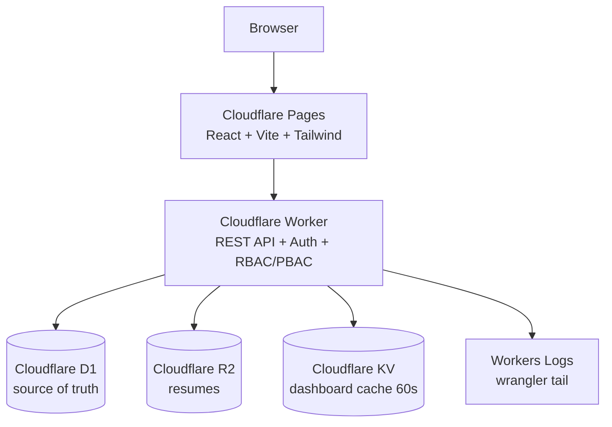

# Student Job Application Tracker (Cloudflare Full-Stack)

A production-style portfolio project for CSE graduates: track job applications, interviews,
notes, follow-ups, and resumes on **100% Cloudflare free-tier-friendly** infrastructure.

 

> Screenshots: add `docs/screenshot-dashboard.png`, `docs/screenshot-applications.png` after first run.

## Features

- **Auth** — register / login / logout, persistent sessions (Bearer token + HttpOnly cookie), PBKDF2-SHA256 password hashing, never returns password hashes. Forgot-password via single-use 1-hour emailed-style tokens (`POST /api/auth/forgot-password`, `POST /api/auth/reset-password`); reset links are written to the server log in local dev (plug in an email provider for production); password reset revokes all sessions.
- **RBAC + PBAC** — roles (`student`, `admin`) with a central permission catalog (`worker/src/authz.ts`); every protected route declares its permission and ownership policies verify `user_id` server-side. Students can only touch their own data; admins get `users.manage`/`admin.access`.
- **Dashboard** — totals (total/applied/interviewing/offers/rejected/saved), by-status chart bars, upcoming interviews, recent applications, overdue + upcoming follow-ups.
- **Applications** — full CRUD with company, title, location, URL, type, salary, date, status (`SAVED/APPLIED/OA/INTERVIEW/OFFER/REJECTED/WITHDRAWN`), notes, contacts, follow-up fields, optional resume link.
- **Search/filter/sort/pagination** — server-side (`LIKE` on company/title, status/type/date filters, newest/oldest, `LIMIT/OFFSET` + total count).
- **Interviews** — linked to an application, types (`PHONE/OA/TECHNICAL/HR/BEHAVIORAL/FINAL`), upcoming list on dashboard.
- **Resumes (R2)** — upload/view(download)/delete, metadata only in D1, strict MIME/size/filename validation, Worker-only R2 access.
- **Notes** — per-application create/edit/delete.
- **Follow-ups** — reminder flag + date + notes; overdue shown separately (`⚠ Follow up with Google, Due: …`).
- **UI** — hamburger + drawer navigation (all breakpoints) with backdrop, Escape/backdrop close, scroll lock, focus return and background `inert`; sticky header with page context + avatar → profile; professional footer; cards, tables, status badges, modals, loading/empty/error states, toasts, confirm-before-delete, responsive, accessible labels + keyboard-focusable dialogs.

## Architecture



- One Worker, one D1 database, one R2 bucket, one KV namespace. No microservices.
- No external job provider: the Tracker is fully self-contained.
- KV caches `dashboard:{userId}` for 60s; D1 is always the source of truth; mutations invalidate the cache.
- Observability via `console.log` in the Worker, read with `wrangler tail`.

## Tech Stack

| Layer | Choice |
|---|---|
| Frontend | React 18, TypeScript, Vite 5, Tailwind CSS 3, React Router 6 |
| Backend | Cloudflare Workers, TypeScript, vanilla REST router (no framework) |
| DB | Cloudflare D1 (SQLite), SQL migrations |
| Files | Cloudflare R2 (Worker-only access) |
| Cache | Cloudflare KV (dashboard stats) |
| Tooling | Wrangler 3, Vitest, GitHub Actions |

## Database Schema

Tables: `users`, `sessions`, `applications`, `interviews`, `notes`, `resumes` — UUID PKs, FKs with `ON DELETE CASCADE/SET NULL`, `created_at/updated_at` timestamps, indexes in `migrations/0002_indexes.sql`.

```
users(id, email UNIQUE, password_hash, name, role DEFAULT 'student', created_at, updated_at)
sessions(id, user_id FK, token_hash UNIQUE, expires_at, created_at)
resumes(id, user_id FK, filename, content_type, size, r2_key UNIQUE, created_at)
applications(id, user_id FK, company, job_title, location, job_url, job_type, salary,
  application_date, status, notes, contact_person, contact_email,
  follow_up_date, follow_up_reminder, follow_up_notes, resume_id FK NULL,
  jobsetu_job_id INT NULL (historical provider provenance; partial UNIQUE(user_id, jobsetu_job_id)), timestamps)
interviews(id, user_id FK, application_id FK, interview_type, scheduled_at, interviewer, meeting_url, notes, result, timestamps)
notes(id, user_id FK, application_id FK, content, timestamps)
```

## API Endpoints

Consistent envelope: `{ "success": true, "data": … }` / `{ "success": false, "error": { "code", "message", "details?" } }`.

```
POST /api/auth/register   POST /api/auth/login   POST /api/auth/logout   GET /api/auth/me
POST /api/auth/forgot-password   POST /api/auth/reset-password
GET  /api/applications?search=&status=&job_type=&date_from=&date_to=&sort=newest|oldest&page=&limit=
POST /api/applications
GET  /api/applications/:id   PUT /api/applications/:id   DELETE /api/applications/:id
GET  /api/interviews?application_id=&upcoming=true   POST /api/interviews
PUT  /api/interviews/:id   DELETE /api/interviews/:id
GET  /api/notes?application_id=   POST /api/notes
PUT  /api/notes/:id   DELETE /api/notes/:id
POST /api/resumes (multipart `file`)   GET /api/resumes
GET  /api/resumes/:id   GET /api/resumes/:id/download   DELETE /api/resumes/:id
GET  /api/dashboard
GET  /api/admin/users   PUT /api/admin/users/:id/role   (admin only)
GET  /api/health
```

## Local Development

Prereqs: Node 20+, `npm`, Wrangler (`npx wrangler --version`).

```bash
# 1. Install
npm install --workspaces
# or: (cd worker && npm install) && (cd frontend && npm install)

# 2. Configure local secrets (placeholders only in repo)
cp worker/.dev.vars.example worker/.dev.vars
cp frontend/.env.example frontend/.env
cp .env.example .env   # reference only

# 3. Create local Cloudflare resources (one-time)
npx wrangler d1 create student_job_tracker      # paste database_id into worker/wrangler.toml
npx wrangler r2 bucket create job-tracker-resumes
npx wrangler kv namespace create CACHE

# 4. Run migrations locally
(cd worker && npm run db:migrate:local)

# 5. Start API + frontend (two terminals — no other services needed)
(cd worker && npx wrangler dev)     # http://127.0.0.1:8787
(cd frontend && npm run dev)        # http://localhost:5173 (proxies /api to :8787)

# 6. Verify
(cd worker && npm test && npm run typecheck)
(cd frontend && npm run typecheck && npm run build)
```

R2 locally works via Wrangler dev (persists under `.wrangler/`); KV cache is optional — the API works without the `CACHE` binding.

## Cloudflare Setup

1. `npx wrangler login`
2. `npx wrangler d1 create student_job_tracker` → set `database_id` in `worker/wrangler.toml`.
3. `npx wrangler d1 migrations apply student_job_tracker --remote` (runs `migrations/`).
4. `npx wrangler r2 bucket create job-tracker-resumes`.
5. `npx wrangler kv namespace create CACHE` → set `id` in `worker/wrangler.toml`.
6. Set secrets: `npx wrangler secret put SESSION_SECRET` (and `FRONTEND_ORIGIN` as var/secret to your Pages URL).
7. Deploy API: `(cd worker && npm run deploy)`.
8. Deploy frontend: set `VITE_API_URL=https://<worker>.workers.dev` in Pages env, then `npx wrangler pages deploy frontend/dist --project-name=student-job-tracker` (or connect the GitHub repo in the Pages dashboard).
9. Observe: `npx wrangler tail` (Workers Logs).

## Environment Variables

| Var | Where | Purpose |
|---|---|---|
| `SESSION_SECRET` | Worker secret / `.dev.vars` | reserved for future signed cookies (sessions currently opaque random tokens, SHA-256 hashed in D1) |
| `FRONTEND_ORIGIN` | Worker var | CORS allow-origin (Pages URL in prod, `http://localhost:5173` locally) |
| `SERPAPI_API_KEY` | Worker secret / `.dev.vars` | SerpApi key for native Discover Jobs. Server-side only — never sent to the browser, never logged, never committed. Unset = live search returns 503 (history/pagination of stored searches still work) |
| `VITE_API_URL` | Pages env / `frontend/.env` | Worker URL; empty = same-origin/Vite proxy |

See `.env.example`, `worker/.dev.vars.example`, `frontend/.env.example`. Never commit real values.

## D1 Migrations

- `migrations/0001_initial.sql` — tables + FKs.
- `migrations/0002_indexes.sql` — indexes for user-scoped filtering/sorting.
- `migrations/0003_jobsetu_provenance.sql` — `jobsetu_job_id` + partial unique index (non-destructive backfill; conflicting pre-existing rows keep NULL and are never deleted/merged).
- `migrations/0004_rbac.sql` — `users.role` (`student` default; existing users stay students) + index.
- `migrations/0005_password_resets.sql` — `password_resets` (selector/token-hash only, 1h expiry, cascade on user delete).
- `migrations/0006_discover.sql` — `discover_searches` (per-user history + normalized result snapshots) and `applications.provider` / `provider_job_id` with a partial unique index (native dedup; `jobsetu_job_id` untouched).
- Never edit prod schema by hand: add `migrations/0005_*.sql` and `wrangler d1 migrations apply … --remote`.

## R2 Setup

- Binding `RESUMES` → bucket `job-tracker-resumes`. Frontend never sees credentials; it POSTs `multipart/form-data` to the Worker, which validates (MIME allow-list pdf/doc/docx/txt, ≤5 MB, sanitized filename) and `PUT`s to `r2_key = {userId}/{resumeId}-{filename}`. Metadata row goes to D1. Download streams via `GET /api/resumes/:id/download` after ownership check. Delete removes R2 object + D1 row and nulls `applications.resume_id`.

## Information architecture (post sign-in)

Public landing (`/`) explains the product with Sign In / Sign Up actions (`/sign-in`, `/sign-up`; legacy `/login`, `/register` redirect). Sign-in is the gateway; logout returns to `/`. The first authenticated screen is a **career command center**, not an analytics dashboard:

- **Home** (`/home`; `/dashboard` redirects here): greeting, three action cards (My Applications, Interviews, Resumes), a Saved → Applied → Interview → Offer pipeline strip, a Next-action card (overdue follow-up first, else most recent Saved), Continue-where-you-left-off, and Upcoming interviews. Metrics are secondary.
- **Discover Jobs** (`/discover`; legacy `/discover-jobs` redirects here): native job search powered server-side by SerpApi (`SERPAPI_API_KEY`, never exposed to the browser). Search by role/keywords, location, and experience; previous-search history; inline details with Apply links; server-side Save/Track with duplicate protection (`409 Already tracked` links the existing application).
- **Applications** (`/applications`): the tracking workspace. Previously imported rows carry an `Imported` source badge (detected from the import note).
- **Interviews**, **Resumes** (`/resumes`): dedicated workspaces; R2 stays Worker-only, metadata in D1.
- **Profile** (`/profile`): account info, role + permission summary, sign-in security. Opened from the header avatar.
- **Admin** (`/admin`, admin role only, backend-enforced): user list with role management (self-change blocked server-side).
- **Settings**: account, session info, integration configuration.

Journey: Sign in → Home → Applications (New application) → Apply → Track → Interview → Offer. Everything is created and tracked directly in JobTracker.

## Job discovery (native, SerpApi-backed)

Discover Jobs is a built-in JobTracker feature: `Browser → JobTracker UI → JobTracker Worker → SerpApi`.
There is no separate provider service and no `JOBSETU_*` configuration. The browser
never contacts SerpApi; the key (`SERPAPI_API_KEY`) lives only in Worker config and
travels exclusively on the server-side outbound call. Identical recent searches are
cached in KV for 24h (payloads carry no user data); per-user search history lives in
`discover_searches`. Saving reuses the shared application insert, so the same native
job can never create two rows for one user (`409 Already tracked` + existing id).

## Historical provider provenance

Earlier versions integrated an external job provider ("JobSetu") for a Discover
Jobs page (`/api/discover/*`, `/discover-jobs`). That integration has been
removed: the provider is no longer required, no browser or Worker code contacts
it, and there is no `JOBSETU_*` configuration anymore. Only two terminals are
needed locally (Worker `:8787`, frontend `:5173`).

What remains, intentionally:

- `applications.jobsetu_job_id` + the partial unique index from migration `0003`
  still protect previously imported rows — saving the same provider reference
  twice via `POST /api/applications` returns `409` with the existing application
  id. The column is never written by any UI anymore.
- Historical duplicate rows (same provider job, `jobsetu_job_id` NULL from the
  non-destructive 0003 backfill) are preserved untouched.
- The dashboard's `discoveryImports` counts rows carrying that provenance; it is
  a historical count, not a live metric.

Run locally: Worker on `:8787`, frontend on `:5173`. No provider service needed.

### Deploying on other machines / production

No ports are hardcoded — every URL is env-configured:

| Where | Variable | Local default | Production value |
|---|---|---|---|
| Pages (frontend build) | `VITE_API_URL` | empty (Vite proxy → `:8787`) | `https://<worker>.<subdomain>.workers.dev` |
| Worker | `FRONTEND_ORIGIN` | `http://localhost:5173` | `https://<pages>.pages.dev` |

Gotchas:
- `VITE_*` vars are baked in at **build** time — set them in the Pages dashboard *before* building, and rebuild after changing them.
- On another dev machine on the same network, replace `localhost`/`127.0.0.1` with the host's LAN IP in all places (and in `worker/.dev.vars`).

## CI/CD

- `.github/workflows/ci.yml` — on PR/push: install, worker typecheck + tests, frontend typecheck + tests + build.
- `.github/workflows/deploy.yml` — on `main`: same checks, then `wrangler deploy` + `wrangler pages deploy`. Required secrets: `CLOUDFLARE_API_TOKEN`, `CLOUDFLARE_ACCOUNT_ID`.

## Security Considerations

- PBKDF2-SHA256 (100k iterations, random 16-byte salt, constant-time verify); no plaintext passwords anywhere.
- Opaque 256-bit session tokens; only SHA-256 hashes stored; 7-day expiry; `HttpOnly; SameSite=Lax; Secure (https)` cookie + Bearer fallback.
- Auth middleware on every `/api/*` (except register/login/health); **every** query is scoped `WHERE user_id = ?`; IDs from the client are never trusted (ownership re-checked for nested resources, e.g. interview → application).
- RBAC (`worker/src/authz.ts`): central `ROLE_PERMISSIONS` (`student` / `admin`); every protected route declares its permission in `index.ts` (401 unauthenticated, 403 forbidden). PBAC `can(user, action, resource)` enforces ownership — students only touch their own rows; `user_id` from request bodies is ignored (server identity is authoritative).
- Admin endpoints (`GET /api/admin/users`, `PUT /api/admin/users/:id/role`) require `users.manage`; self-role-change is rejected.
- All SQL parameterized via `prepare().bind()`; no string interpolation.
- Input validation on both sides; centralized error handler (500s never leak stacks/DB errors; diagnostics go to Workers Logs).
- CORS allow-listed to `FRONTEND_ORIGIN`; rate-limit on auth endpoints (KV-backed, fail-open if KV missing).
- File validation: MIME + extension allow-list, 5 MB cap, filename sanitization, per-user R2 prefix.

## Future Improvements

- Refresh-token rotation + password reset via email.
- Full-text search (FTS5) and saved filters.
- Resume parsing (PDF text extraction) + application-resume matching.
- Email/push reminders for follow-ups (Queues + scheduled cron).
- E2E tests (Playwright) and preview deployments per PR.

## Project Structure

```
project/
├── frontend/src/{components,pages,hooks,services,types,utils}
├── worker/src/{routes,middleware,validation,utils,db} + index.ts
├── worker/tests/  migrations/  docs/competitive-analysis.md  .github/workflows/
├── README.md  .gitignore  package.json
```

Frontend tests (`frontend/src/**/*.test.tsx`, vitest + jsdom + Testing Library) cover the Home command center, auth-gated routing (`/home` blocked when logged out, `/dashboard` → `/home`, retired discover URLs → `/home`), the navigation drawer (backdrop/Escape/nav-close, admin visibility) + footer, profile/admin pages, and permissions helpers.
